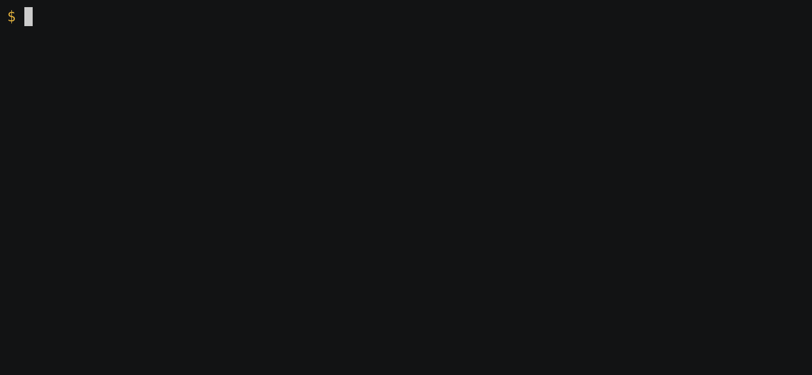

## Character entry and highlighting


### Demo Notes

I hit the _Tab_ key after `Inte` to get the completions


    Integer          IntegerExponent  IntegerQ         IntegerString    Integrate
    IntegerDigits    IntegerLength    IntegerReverse   Integers

Ater adding `gr` though there was just one completion: `Integrate`.

To get the theta (θ), I entered: _escape_ .Theta _escape_.

The next time around I entered `\[The` and the _Tab_ key.

The orange color is in output is the color the Pygments default dark style `paraiso-dark` uses for numbers.

The output for the integration is Symbolic. So I requested the numeric approximation.

The uparrow key (or with the default Emacs bindings _Ctrl_-P was used twice to get to the previous command `Integrate[Sin[θ], {\[Theta], 0, 1}]`

To edit line this I used again the Emacs default bindings: _Ctrl_-E o get to the end of the line, _Ctrl_-B to move backwards, and _Ctrl_-D to delete a character.

### Multi-line entry



## Demo Notes for part 2

Note the indentation on `In[1]` after the first line because we don't have a complete line.

After completing the `Grid` statement I entered up-arrow again to show that in the history, this multi-line statement is recorded as just one history entry with several lines.

Then I did a reverse search _Ctrl_-R to retrieve the `Integrate` input again. Notice that in the history is saved across sessions.

## How the GIFs were created

The "cast" screenshot was made with asciienema and then running through `asciicast2gif`.

For example:

```
$ asciinema play mathicsscript1.caste
```

You can edit the `.cast` files. The specific commands used after this were:

```console
$ agg mathicsscript1.{cast,gif}
$ agg mathicsscript2.{cast,gif}
```
